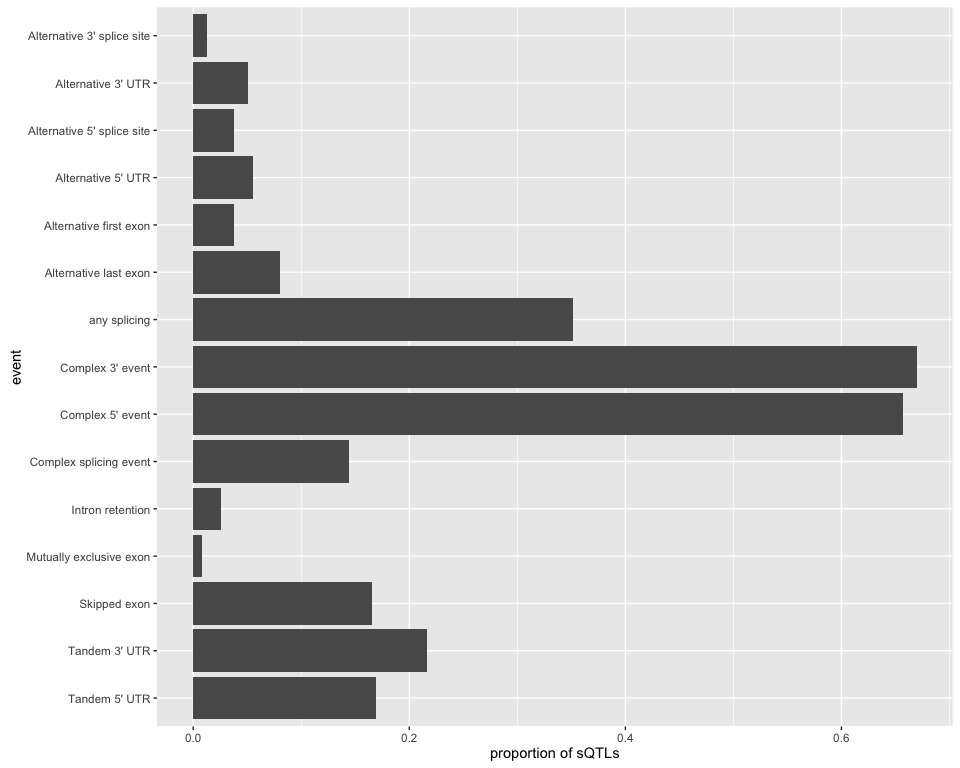
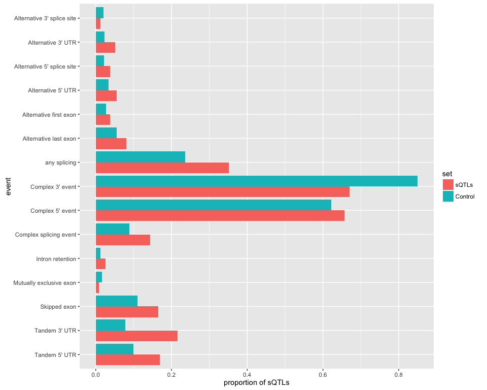

Splicing events classification
==============================

Introduction
------------

sQTLseeker finds association between a SNP and the relative expression a gene's transcripts, however **we don't know exactly what splicing mechanism is involved**. One way to have an idea of the mechanism or the change that the variant could cause, is to **compare the structure of the transcripts** whose relative expression change. For example, if a transcript with a particular exon becomes less used while the same transcript but lacking this exon becomes more used, the main mechanism could be exon skipping.

In practice, we **compare the structure of the two transcripts whose relative usage changes the most**. These two transcripts are specified in columns *tr.first* and *tr.second* of the output of `sqtl.seeker`/`sqtls` functions.

To compare the structure of pairs of transcripts, we can either use [AStalavista](http://genome.crg.es/astalavista/) or the build-in function in the package (`classify.events`). The following code shows how to use this function, which was highly inspired from AStalavista.

Building the transcript structure
---------------------------------

The *data.frame* with the transcript structure must have these columns:

-   `trId`: the transcript ID.
-   `strand`: the DNA strand.
-   `cdsStart`: the start positions of the CDS regions, separated by `,`.
-   `cdsEnd`: same with the end positions.
-   `urtStarts` and `utrEnds`: same with UTR regions.

Depending on the annotation you are using, you might need to build this *data.frame* manually. In a later example, we'll see how to construct it from a Gencode annotation.

For now, let's create a simple one to see how the function works.

``` r
tr.str = data.frame(trId=c("t1","t2","t3"),
                    strand="+",
                    cdsStarts=c("10,40,100","10,20,100","10,40,100"),
                    cdsEnds=c("15,55,130","15,30,130","15,55,130"),
                    utrStarts=c("5,130","5,130","5,130"),
                    utrEnds=c("10,135","10,135","10,150"))
tr.str
```

    ##   trId strand cdsStarts   cdsEnds utrStarts utrEnds
    ## 1   t1      + 10,40,100 15,55,130     5,130  10,135
    ## 2   t2      + 10,20,100 15,30,130     5,130  10,135
    ## 3   t3      + 10,40,100 15,55,130     5,130  10,150

Comparing pairs of transcripts
------------------------------

We will compare the structure of transcripts pairs *t1* vs *t2*, and *t1* vs *t3*. We load the package and run:

``` r
library(sQTLseekeR)
tr.df = data.frame(tr.first=c("t1","t1"), tr.second=c("t2","t3"))
classify.events(tr.df, tr.str)
```

    ## $res
    ##   tr.first tr.second  classCode              classEvent
    ## 1       t1        t2  3-4^,1-2^ Mutually exclusive exon
    ## 2       t1        t3 <>,1^),2^)           Tandem 3' UTR
    ## 
    ## $stats
    ##                     event count prop prop.sqtl
    ## 1 Mutually exclusive exon     1  0.5       0.5
    ## 2           Tandem 3' UTR     1  0.5       0.5
    ## 3            any splicing     1   NA       0.5

The result is a *list* with the event code and name for each pair, as well as a *data.frame* with the global count of each event in the data.

It found *Mutually exclusive exons* between transcript *t1* and *t2*. Transcripts *t1* and *t3* have the same CDS but differ in their last UTR, hence the event found being *Tandem 3' UTR*.

Classifying transcripts from Genecode annotation.
-------------------------------------------------

In practice the input is a larger *data.frame* with information about each sQTL, including the relevant columns *tr.first* and *tr.second*. These two columns contains the IDs of the two transcripts whose relative expression change the most.

In the next example, we start by constructing the transcript structure for some genes from Gencode annotation V12, available [here](http://www.gencodegenes.org/releases/12.html).

First we download the file and read it.

``` r
download.file("ftp://ftp.sanger.ac.uk/pub/gencode/Gencode_human/release_12/gencode.v12.annotation.gtf.gz","../Data/gencode.v12.annotation.gtf.gz")
gtf = read.table("../Data/gencode.v12.annotation.gtf.gz", as.is=TRUE, sep="\t")
colnames(gtf) = c("chr","source","type","start","end","score","strand","score2","info")
```

Then for each transcript with CDS or UTRs, we concatenate the start/end positions.

``` r
library(dplyr)
concat <- function(x) paste(x, collapse=",")
trans.str = gtf %>% filter(type %in% c("CDS","UTR")) %>%
    mutate(trId=gsub(".*transcript_id ([^;]+);.*","\\1",info),
           geneId=gsub(".*gene_id ([^;]+);.*","\\1",info)) %>%
        group_by(trId, geneId, strand) %>%
            summarize(cdsStarts=concat(start[type=="CDS"]),
                      cdsEnds=concat(end[type=="CDS"]),
                      utrStarts=concat(start[type=="UTR"]),
                      utrEnds=concat(end[type=="UTR"]))
```

For transcripts without CDS, we use the *exon* annotation instead. This is optional and not necessary if you analyze only protein-coding genes.

``` r
exon.str = gtf %>% filter(type=="exon") %>%
    mutate(trId=gsub(".*transcript_id ([^;]+);.*","\\1",info),
           geneId=gsub(".*gene_id ([^;]+);.*","\\1",info)) %>%
        filter(!(trId %in% trans.str$trId)) %>%
            group_by(trId, geneId, strand) %>%
                summarize(cdsStarts=concat(start),cdsEnds=concat(end),
                          utrStarts=NA, utrEnds=NA)
trans.str = rbind(trans.str, exon.str)
```

The results is available in the [Data](https://github.com/guigolab/sQTLseekeR/tree/master/Data) folder, but the code shows you how to format the object from scratch.

Now we read the sQTLs from one population, CEU. After erasing the event classification, we recompute them using `classify.events`.

``` r
sqtl.df = read.table("../Data/sQTLs-FDR10-CEU.tsv.gz", as.is=TRUE, header=TRUE, sep="\t", quote="")
sqtl.df$classCode = sqtl.df$classEvent = NULL
ev.sqtls = classify.events(sqtl.df, trans.str)
```

The annotated results is visible in

``` r
head(ev.sqtls$res)
```

    ##            snpId             geneId       pvalue        FDR geneName
    ## 1 snp_1_24739773 ENSG00000001460.12 0.0002315386 0.07105199    STPG1
    ## 2 snp_1_24730937 ENSG00000001460.12 0.0002315386 0.07105199    STPG1
    ## 3 snp_1_24739745 ENSG00000001460.12 0.0002315386 0.07105199    STPG1
    ## 4 snp_1_24714396 ENSG00000001460.12 0.0002315386 0.07105199    STPG1
    ## 5 snp_1_24740713 ENSG00000001460.12 0.0002315386 0.07105199    STPG1
    ## 6 snp_1_24742986 ENSG00000001460.12 0.0002315386 0.07105199    STPG1
    ##            tr.first         tr.second                     classCode
    ## 1 ENST00000003583.8 ENST00000468303.1 (4-,(1-2^3-;,1-2^3-4^;1^),2^)
    ## 2 ENST00000003583.8 ENST00000468303.1 (4-,(1-2^3-;,1-2^3-4^;1^),2^)
    ## 3 ENST00000003583.8 ENST00000468303.1 (4-,(1-2^3-;,1-2^3-4^;1^),2^)
    ## 4 ENST00000003583.8 ENST00000468303.1 (4-,(1-2^3-;,1-2^3-4^;1^),2^)
    ## 5 ENST00000003583.8 ENST00000468303.1 (4-,(1-2^3-;,1-2^3-4^;1^),2^)
    ## 6 ENST00000003583.8 ENST00000468303.1 (4-,(1-2^3-;,1-2^3-4^;1^),2^)
    ##                                                 classEvent
    ## 1 Complex 3' event;Complex 5' event;Complex splicing event
    ## 2 Complex 3' event;Complex 5' event;Complex splicing event
    ## 3 Complex 3' event;Complex 5' event;Complex splicing event
    ## 4 Complex 3' event;Complex 5' event;Complex splicing event
    ## 5 Complex 3' event;Complex 5' event;Complex splicing event
    ## 6 Complex 3' event;Complex 5' event;Complex splicing event

There is also a summary *data.frame*. Here *count* (*prop*) represents the number (proportion) of time an event is observed relative to the other events. However *prop.sqtl* represents the proportion of sQTLs (or input pairs) that contain each event. These numbers are different because one sQTL (or transcript pair) can involve several events.

This summary *data.frame* is useful to plot the global distribution of the events.

``` r
head(ev.sqtls$stats)
```

    ##                    event count       prop  prop.sqtl
    ## 1     Alternative 5' UTR    13 0.02363636 0.05508475
    ## 2 Alternative first exon     9 0.01636364 0.03813559
    ## 3       Complex 3' event   158 0.28727273 0.66949153
    ## 4 Complex splicing event    34 0.06181818 0.14406780
    ## 5           Skipped exon    39 0.07090909 0.16525424
    ## 6       Complex 5' event   155 0.28181818 0.65677966

``` r
library(ggplot2)
ggplot(ev.sqtls$stats, aes(x=event, y=prop.sqtl)) + geom_bar(stat="identity") + coord_flip() + ylab("proportion of sQTLs")
```



Null distribution
-----------------

It's good to know the general distribution of the splicing events affected by sQTLs but we might wonder what type of events happen in general. To investigate this null distribution we can pick two random transcripts in each the same genes that are affected by sQTLs and see what type of events differentiate them.

``` r
## Function that picks two random transcripts for an input gene
geneToTrans = tapply(trans.str$trId, trans.str$geneId, identity)
pickRandomTrans <- function(gene) head(c(sample(geneToTrans[[gene]]),NA, NA),2)
## Build a data.frame with the random transcript pairs
cont.pairs = sapply(sqtl.df$geneId, pickRandomTrans)
cont.pairs = as.data.frame(t(cont.pairs))
colnames(cont.pairs) = c("tr.first","tr.second")
```

Once these control transcript pairs are ready, we run the classifier.

``` r
ev.cont = classify.events(cont.pairs, trans.str)
```

Now, we can merge this results with the sQTLs' ones and compare the distributions.

``` r
stats.df = rbind(data.frame(set="sQTLs", ev.sqtls$stats),
    data.frame(set="Control", ev.cont$stats))
ggplot(stats.df, aes(x=event, y=prop.sqtl, fill=set)) + geom_bar(stat="identity", position="dodge") + coord_flip() + ylab("proportion of sQTLs")
```



Appendix
--------

Here is an illustration of the different events we consider:


R session
---------

``` r
sessionInfo()
```

    ## R version 3.2.3 (2015-12-10)
    ## Platform: x86_64-apple-darwin13.4.0 (64-bit)
    ## Running under: OS X 10.10.5 (Yosemite)
    ## 
    ## locale:
    ## [1] en_CA.UTF-8/en_CA.UTF-8/en_CA.UTF-8/C/en_CA.UTF-8/en_CA.UTF-8
    ## 
    ## attached base packages:
    ## [1] stats     graphics  grDevices utils     datasets  methods   base     
    ## 
    ## other attached packages:
    ## [1] ggplot2_2.1.0   dplyr_0.5.0     sQTLseekeR_2.1  rmarkdown_0.9.6
    ## 
    ## loaded via a namespace (and not attached):
    ##  [1] Rcpp_0.12.7      knitr_1.13.1     magrittr_1.5     munsell_0.4.3   
    ##  [5] colorspace_1.2-6 R6_2.1.2         plyr_1.8.4       stringr_1.1.0   
    ##  [9] tools_3.2.3      grid_3.2.3       data.table_1.9.6 gtable_0.2.0    
    ## [13] DBI_0.5-1        htmltools_0.3.5  yaml_2.1.13      lazyeval_0.2.0  
    ## [17] digest_0.6.10    assertthat_0.1   tibble_1.2       formatR_1.4     
    ## [21] codetools_0.2-14 evaluate_0.9     labeling_0.3     stringi_1.1.1   
    ## [25] scales_0.4.0     chron_2.3-47
